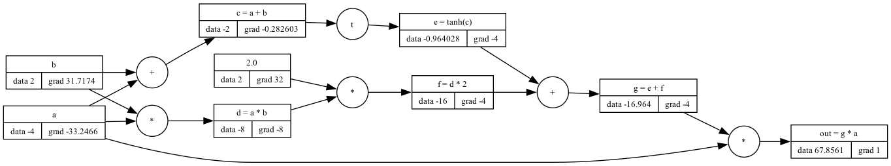
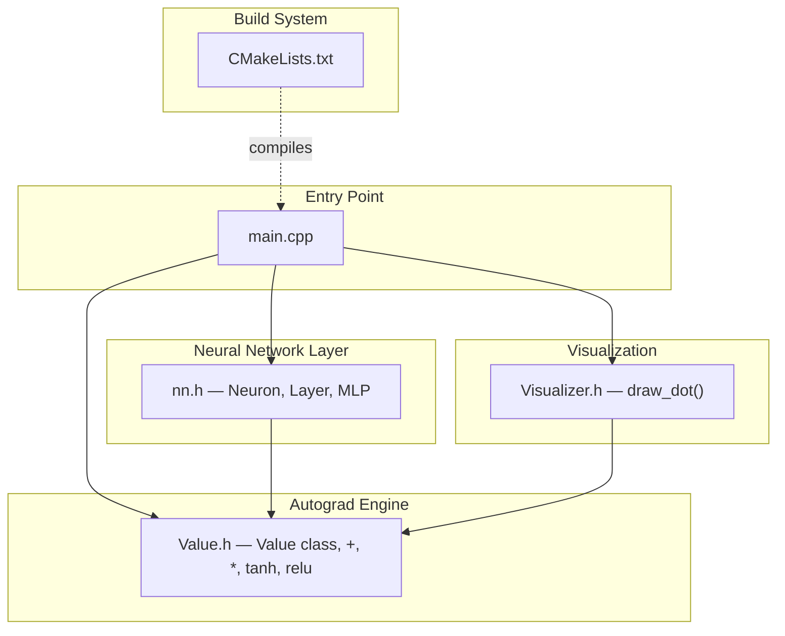
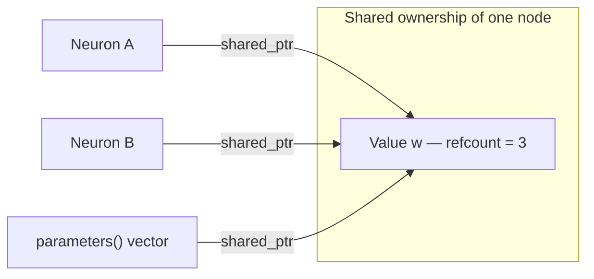
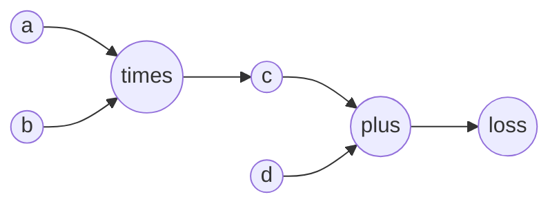
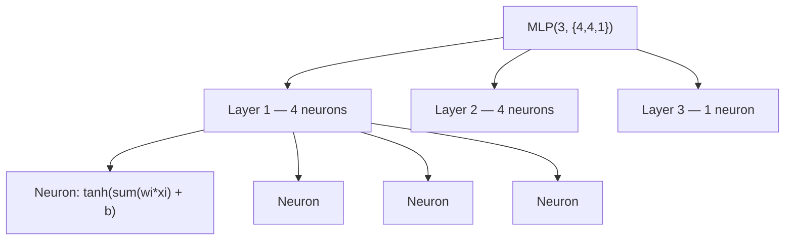
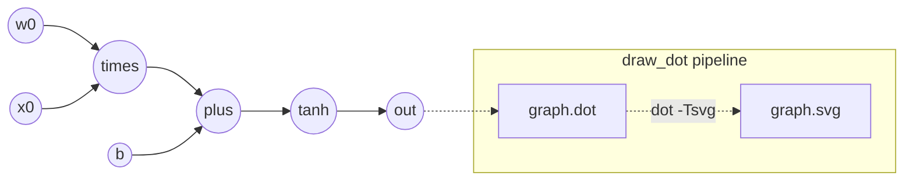

# CppMicrograd

**A tiny reverse-mode automatic differentiation engine and neural network library, written from scratch in modern C++17.**

Inspired by [Andrej Karpathy's `micrograd`](https://github.com/karpathy/micrograd) (Python), reimplemented in C++ using `shared_ptr`-managed computation graphs, `std::function` closures for backpropagation, and Graphviz for visualization.

<p align="center">
  
</p>

---

## Table of Contents

- [Overview](#overview)
- [Features](#features)
- [Project Structure](#project-structure)
- [Core Concepts](#core-concepts)
  - [The `Value` Node](#1-the-value-node--the-atom-of-computation)
  - [Why a Pointer at All? Why *That* Pointer?](#2-why-a-pointer-at-all-why-that-pointer)
  - [Forward Pass](#3-forward-pass--building-the-graph)
  - [Backward Pass](#4-backward-pass--reverse-mode-autodiff)
  - [`+` vs `*`: The Chain Rule in Code](#5--vs---the-chain-rule-in-code)
  - [Activations](#6-activation-functions)
- [Neural Network Architecture](#neural-network-architecture-nnh)
- [Visualizing the Graph](#visualizing-the-computation-graph-visualizerh)
- [Getting Started](#getting-started)
- [Roadmap](#roadmap--future-work)
- [Acknowledgements](#acknowledgements)

---

## Overview

`CppMicrograd` builds a computation graph at runtime, one scalar `Value` node at a time. Every arithmetic operation (`+`, `*`, `tanh`, `relu`) doesn't just compute a result — it quietly records *how* to compute the local gradient of that result with respect to its inputs, and stashes that recipe away for later. Once a full forward pass is done (say, computing a loss), calling `.backward()` walks the graph in reverse and lets every node collect its gradient via the chain rule. That's backpropagation — the same idea that powers PyTorch's `autograd`, just stripped down to its bones and written in C++.

On top of the engine, `nn.h` builds a small MLP (Multi-Layer Perceptron): `Neuron → Layer → MLP`, trained on a toy dataset in `main.cpp` using plain gradient descent.

## Features

- Scalar-valued autograd engine — every number is a graph node (`Value`), not just a `double`
- Dynamic graph construction — the graph is built as expressions are evaluated, not declared upfront
- Reverse-mode automatic differentiation — exact gradients via the chain rule, no numerical approximation
- A minimal neural network library — `Neuron`, `Layer`, `MLP` composed directly on top of `Value`
- Natural operator overloading — write math as `a + b`, `a * b`, `tanh(x)`, `relu(x)`
- Graph visualization — exports the computation graph to Graphviz `.dot` / `.svg`
- Careful, leak-free memory management using `shared_ptr` and `std::function` closures — no manual `new` / `delete` anywhere

---

## Project Structure



`CMakeLists.txt` expects headers under `include/` and the entry point under `src/`. If your files are currently sitting flat in the project root, move the three `.h` files into `include/` and `main.cpp` into `src/`, or update the paths in `CMakeLists.txt` to match wherever they actually live.

---

## Core Concepts

### 1. The `Value` Node — the atom of computation

Every number that flows through the engine is wrapped in a `Value`:

```cpp
class Value {
public:
    double data;                              // the scalar value itself
    unordered_set<shared_ptr<Value>> prev;    // children in the graph
    double grad = 0.0;                        // accumulated gradient
    char op;                                  // which op produced this node
    function<void()> backward;                // closure: how to push grad to children
    string label;                             // human-readable name (for visualization)
};
```

Each `Value` is a data holder and a graph node at the same time: `data` is the forward-pass result, `grad` accumulates ∂loss/∂this during the backward pass, `prev` is the set of nodes it was built from, and `backward` is a self-contained closure that knows exactly how to hand its gradient down to its parents in `prev`.

### 2. Why a Pointer at All? Why *That* Pointer?

Before looking at any operator code, it's worth pausing on a question that's easy to skip past: why is `Value` wrapped in a pointer everywhere, and why specifically the scary-looking `shared_ptr` instead of something simpler? It helps to walk through it the way you'd naturally arrive at the answer, by ruling out the simpler options first.

**Could we just use `Value` directly, as a plain object?**

Not really. Every operation — `operator+`, `operator*`, `tanh(...)` — creates a *new* `Value` and needs to remember which nodes it was built from, because the backward pass will need to walk back through those same nodes later. If `Value` objects lived as ordinary local variables, they'd be destroyed the moment the function that created them returned, or the moment they went out of scope. The graph would be pulling on nodes that no longer exist. The whole point of the engine is that the graph has to *outlive* the individual lines of code that built it — so the nodes need to live somewhere more durable than the stack: the heap, accessed through a pointer.

**Okay, so a pointer — but why not a plain, "dumb" `Value*`?**

This is where it gets tricky. A `Value` node in this engine is rarely owned by just one thing — a weight is reused by the same neuron across every training example, and the same variable can appear more than once inside a single expression. So more than one part of the graph legitimately needs to keep a `Value` alive at the same time. With a raw pointer, *someone* has to be responsible for eventually calling `delete` on it — but if two different owners both think they're responsible, one of them deletes it while the other still holds a pointer to it, and now you have a dangling pointer and undefined behavior the moment it's touched again. And if, to be safe, *nobody* deletes it, then it simply never gets freed, and every training epoch leaks a little more memory. With shared ownership and manual pointers, you're stuck choosing between crashes and leaks.

**So the real problem to solve is shared ownership — and that's precisely what `shared_ptr` was built for.**

A `shared_ptr<Value>` keeps a running reference count behind the scenes. Every time another `Value`'s `prev` set stores a copy of it, or a variable holds onto it, the count goes up. Every time one of those references goes away — a `prev` set is destroyed, a local variable falls out of scope — the count goes down. The node is only actually freed once that count hits zero, which is exactly the moment nothing in the graph needs it anymore. No manual bookkeeping, no picking a single "owner," and no leaks or dangling pointers from getting that bookkeeping wrong.



**One more twist — the story doesn't quite end there.** Look closely at `operator+`:

```cpp
auto y = make_shared<Value>(a->data + b->data, children, '+');
Value* y_ptr = y.get();                 // a raw pointer, deliberately not a shared_ptr
auto f = [a, b, y_ptr]() {
    a->grad += y_ptr->grad;
    b->grad += y_ptr->grad;
};
y->backward = f;                        // y now stores a closure that refers back to y
```

The closure `f` is stored inside `y->backward` — so `y` owns `f`. If `f` had also captured `y` itself as a `shared_ptr`, then `y` would end up holding a reference to something that holds a reference back to `y`: a self-referential cycle. In a cycle like that, the reference count never reaches zero on its own, and `shared_ptr`'s automatic cleanup quietly stops working — every node in the graph would leak, just in a subtler way than the raw-pointer problem above.

The fix already sitting in the code is to capture `y_ptr` as a plain `Value*` instead. The closure can still read `y_ptr->grad` whenever it eventually runs, but it doesn't *own* `y` — so there's no cycle. This is safe because `y` is guaranteed to still be alive at the moment `backward()` actually runs (it's kept alive externally, by the topological-sort vector built in `main.cpp`). `a` and `b`, meanwhile, genuinely do need to be owned by the closure, since they're the targets the gradient update writes into — so they're correctly captured by `shared_ptr`.

| Capture | Type | Why |
|---|---|---|
| `a`, `b` (children) | `shared_ptr<Value>` | Must be kept alive so their `grad` can still be updated later |
| `y_ptr` (self) | raw `Value*` | Avoids a self-reference cycle; `y` already owns this closure and is kept alive externally during backprop |

### 3. Forward Pass — building the graph

Every overloaded operator does two things at once: computes the result, and wires up how to compute gradients later.

```cpp
inline shared_ptr<Value> operator*(shared_ptr<Value> a, shared_ptr<Value> b) {
    unordered_set<shared_ptr<Value>> children = {a, b};
    auto y = make_shared<Value>(a->data * b->data, children, '*');
    // backward closure attached here
    return y;
}
```

By the time an expression like `loss = (ypred + target) * (ypred + target)` finishes evaluating, there isn't just a number sitting in `loss` — there's a fully-formed graph connecting `loss` all the way back to every weight and bias in the network.

### 4. Backward Pass — reverse-mode autodiff

To get gradients, `main.cpp` does two things:

1. **Topological sort** — visits every node such that a node always appears *after* all of its children (depth-first, post-order).
2. **Reverse traversal** — walks that order backwards, calling `node->backward()` on each one. Because parents are visited before their children in this reversed order, every node's `grad` is fully accumulated before it's asked to push gradient further down.



The forward pass computes `L` left to right. The backward pass seeds `L.grad = 1.0` and walks right to left, with each node's `backward()` closure pushing gradient onto its children using the local derivative:

```
dL/dd = dL/dL * 1              (+ passes grad straight through)
dL/dc = dL/dL * 1
dL/da = dL/dc * b.data          (x multiplies by the *other* operand)
dL/db = dL/dc * a.data
```

### 5. `+` vs `*`: The Chain Rule in Code

This is the heart of backprop, and the two operators show the two fundamental patterns you'll see over and over:

| Operation | Forward | dout/da | dout/db | Backward code |
|---|---|:---:|:---:|---|
| Add `a + b` | `out = a + b` | `1` | `1` | `a.grad += out.grad;`  `b.grad += out.grad;` |
| Multiply `a * b` | `out = a * b` | `b` | `a` | `a.grad += out.grad * b.data;`  `b.grad += out.grad * a.data;` |
| tanh `tanh(x)` | `out = tanh(x)` | `1 - out^2` | — | `x.grad += (1 - out*out) * out.grad;` |
| ReLU `relu(x)` | `out = max(0, x)` | `1` if `x>0` else `0` | — | `x.grad += (out.data>0 ? 1:0) * out.grad;` |

**Addition distributes the gradient unchanged.** Since d(a+b)/da = 1 and d(a+b)/db = 1, the incoming gradient just gets copied straight through to both operands, no scaling, no lookup involved. `+` behaves like a pure gradient router.

**Multiplication swaps in the *other* operand.** Since d(a*b)/da = b, the gradient flowing back into `a` is the output's gradient scaled by `b`'s value — and symmetrically for `b`. This is exactly why, inside `Neuron`, the gradient flowing back into a **weight** ends up scaled by that neuron's **input**, and the gradient flowing back into the **input** ends up scaled by the **weight**: each operand's gradient depends on whatever it was multiplied against, never on itself.

### 6. Activation Functions

`tanh(x)` and `relu(x)` follow the same shape as `+` and `*`: compute the forward value, then attach a `backward` closure using the matching derivative — `1 - tanh(x)^2` for tanh, the step function for ReLU.

---

## Neural Network Architecture (`nn.h`)

Built entirely out of `Value` objects and the operators above, with no separate "layer math" — just composed scalar operations.



- **`Neuron`** holds a `vector<shared_ptr<Value>>` of weights plus one bias `Value`. Calling it computes `tanh(sum(wi * xi) + b)`.
- **`Layer`** is a `vector<Neuron>`; calling it runs every neuron on the same input and collects the outputs.
- **`MLP`** is a `vector<Layer>`; calling it feeds each layer's output into the next.
- **`parameters()`**, at every level, walks down and collects every learnable `shared_ptr<Value>` (weights and biases) into one flat vector — this is what the training loop in `main.cpp` zeroes gradients on and updates via gradient descent.

---

## Visualizing the Computation Graph (`Visualizer.h`)

`draw_dot()` walks the graph from a root `Value` (say, the final loss or output), and emits a Graphviz `.dot` file: one record node per `Value`, showing its `label`, `data`, and `grad`, and a small circular node per operation (`+`, `*`, `t` for tanh, `r` for relu). `main.cpp` then shells out to the `dot` CLI to render an `.svg`, and calls `open` to view it.



Requires [Graphviz](https://graphviz.org/) installed (for the `dot` command). Note that `system("open ...")` is macOS-specific — on Linux swap it for `xdg-open`, on Windows for `start`.

---

## Getting Started

### Prerequisites

- CMake 3.10 or newer
- A C++17 compiler
- Graphviz, for the `dot` command — on macOS: `brew install graphviz`

### A note for macOS users: no `<bits/stdc++.h>`

If you're used to competitive-programming-style C++ with `#include <bits/stdc++.h>`, it's worth knowing that this header is a GCC-only convenience file — it doesn't ship with Clang, which is the default compiler on macOS via the Xcode Command Line Tools. Since `bits/stdc++.h` simply isn't available there, this project includes each standard header it actually needs, explicitly:

```cpp
#include <iostream>
#include <unordered_set>
#include <memory>
#include <string>
#include <cmath>
#include <algorithm>
#include <functional>
```

This is generally better practice anyway — explicit includes make dependencies clear and keep compile times down. On Linux with GCC, `bits/stdc++.h` would still work as a shortcut, but it isn't portable, which is why it's avoided here.

### Build and Run

```bash
mkdir build && cd build
cmake ..
make
./micrograd
```

This runs the training loop in `main.cpp`: a 3-input MLP with hidden layers `[4, 4, 1]`, trained for 20 epochs of plain gradient descent on a 4-example toy dataset. It prints the loss per epoch and the final predictions, then renders `graph.svg` for the final forward pass.

---

## Acknowledgements

Conceptually based on [Andrej Karpathy's `micrograd`](https://github.com/karpathy/micrograd) — this project reimplements the same core ideas (scalar autograd, graph-based backprop) in modern C++, using `shared_ptr` and `std::function` in place of Python's dynamic object references and closures.

